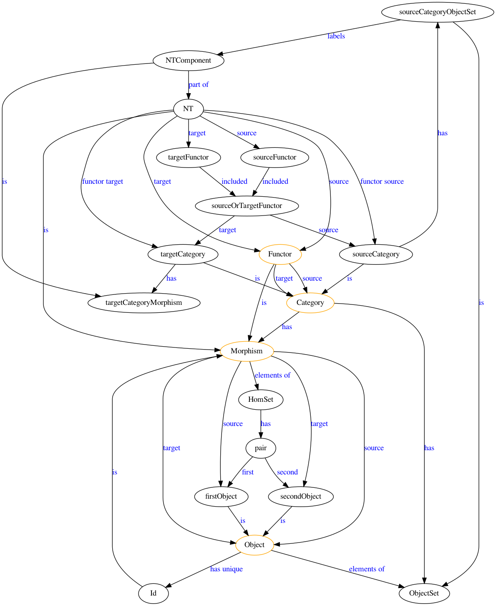
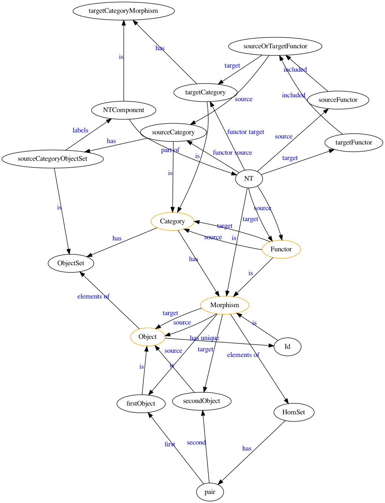
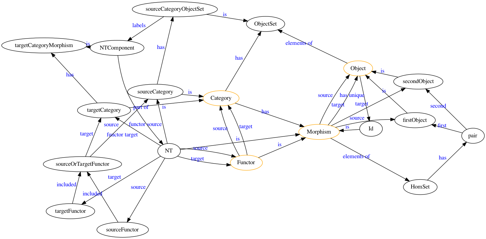
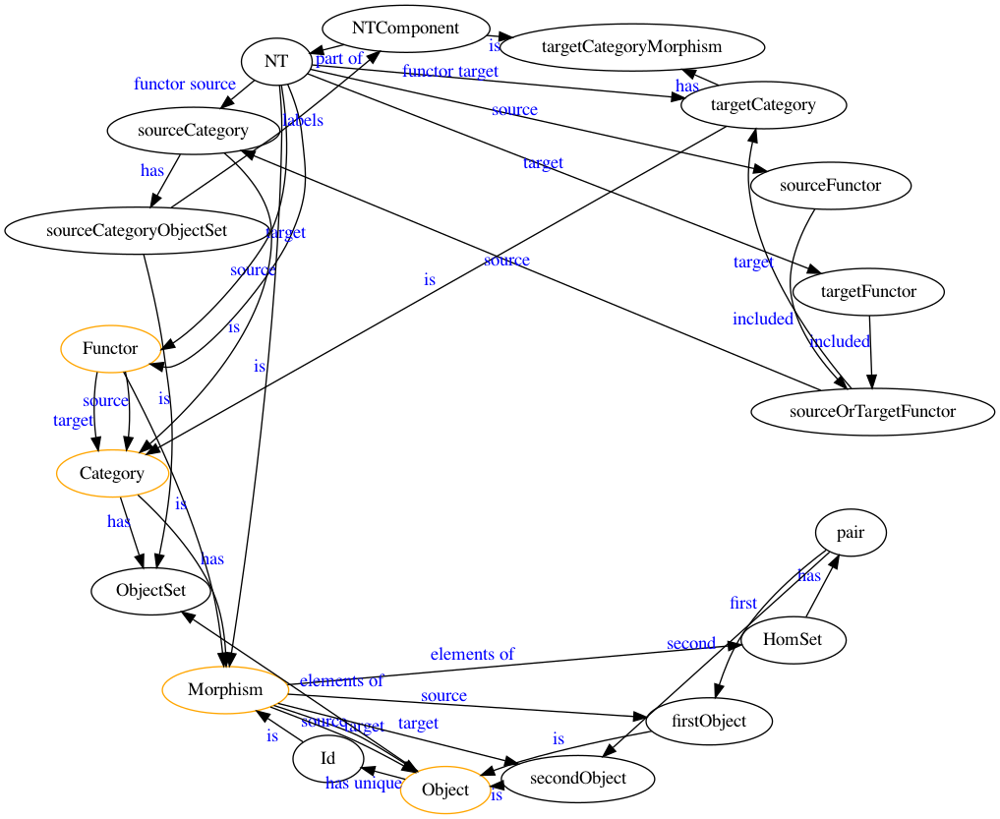

### VS Code extension

[Graphviz (dot) language support for Visual Studio Code](https://github.com/joaompinto/vscode-graphviz) by João Pinto

### Dot layout

### Neato layout

### Sfdp layout

### Circo layout

